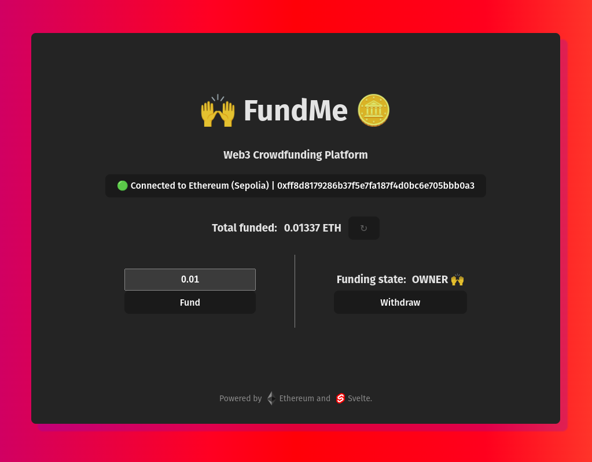

# Svelte FundMe

Web interface for interacting with the [FundMe](https://github.com/Cyfrin/foundry-fund-me-f23) smart contract.



## Features
* Made with [Svelte](https://svelte.dev/), an amazing component framework.
* Responsive-first design.
* [Metamask](https://metamask.io/) integration.
* Display account roles and amount funded by funder accounts.
* Seamlessly connect, disconnect and switch accounts without refreshing.
* Notifications for transaction status, including confirmations and errors.
* Crowdfunding funds automatically refresh on user transactions.
* Improved development experience with [Husky](https://github.com/typicode/husky), [ESLint](https://eslint.org/) and [Prettier](https://prettier.io/).


A video showcasing the interface functionality can be found [here](https://www.youtube.com/watch?v=QBmJYdNArG8).

## Getting started

**IMPORTANT**: If you intend to use the interface with a different
contract address in Ethereum Sepolia, Ethereum Mainnet or Anvil, see
[Using your own contract](#using-your-own-contract) down below.

### Requirements
* [`pnpm`](https://pnpm.io/) (recommended ^8.0.0)).

### Building from sources

Run the following commands in the root directory of the repository:
```
pnpm install
pnpm build
```

### Running the interface
To open the web interface, navigate to the generated `dist/` directory
and serve the files using the web server of your choice.

For local access, the simplest way of deploying it would be to run:

```
pnpm preview
```

then access to the interface exposed in [http://localhost:4173/](http://localhost:4173/).

### Using your own contract
In order to use your own contract, replace the `CONTRACT_ADDRESS` constant
in [`src/lib/constants.ts`](https://github.com/oxcabe/svelte-fund-me/tree/main/src/lib/constants.ts) with the
address of the desired contract.

Ensure that the ABI is  compatible to the one already configured
in the project, `CONTRACT_ABI` located also in the same file.

Currently supported chains are:
* **Ethereum** - Mainnet.
* **Ethereum** - Sepolia.
* **Anvil** (or any other custom networks that use `1337` as chain ID).

## Acknowledgements
**Huge** thanks to [Patrick Collins](https://twitter.com/PatrickAlphaC) and [Cyfrin](https://www.cyfrin.io/) for their free, high quality
educational resources.

If this project helped you, feel free to share it to your friends and colleagues, or even donate!

**Donation address (Ethereum/Arbitrum/Optimism/zkEVM):** 0xf39Fd6e51aad88F6F4ce6aB8827279cffFb92266